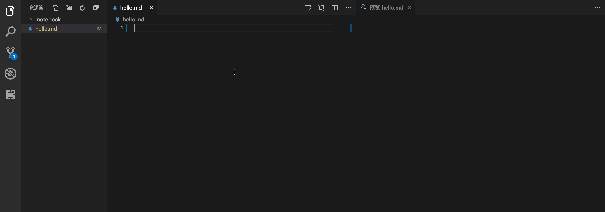
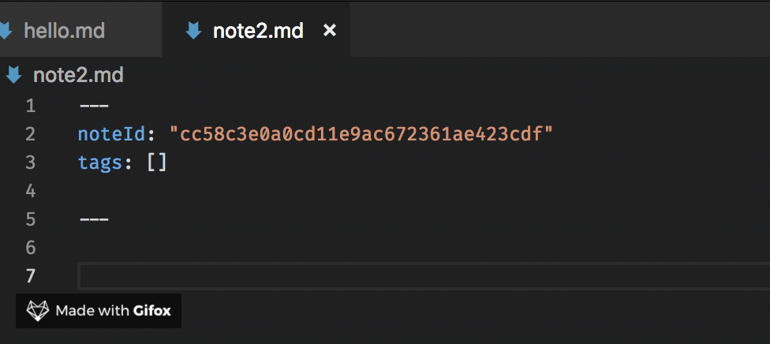
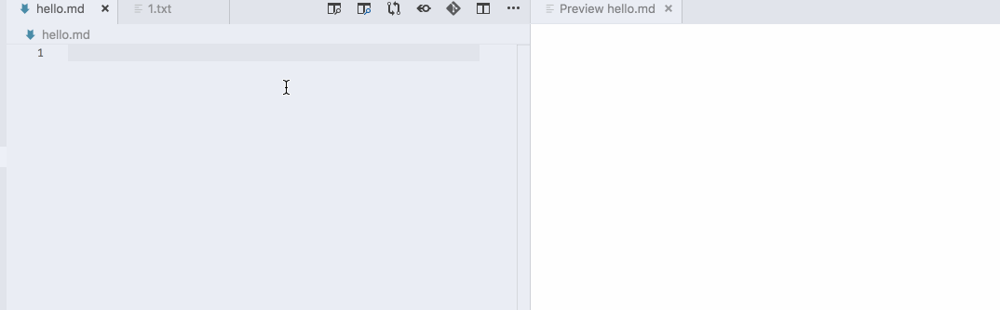
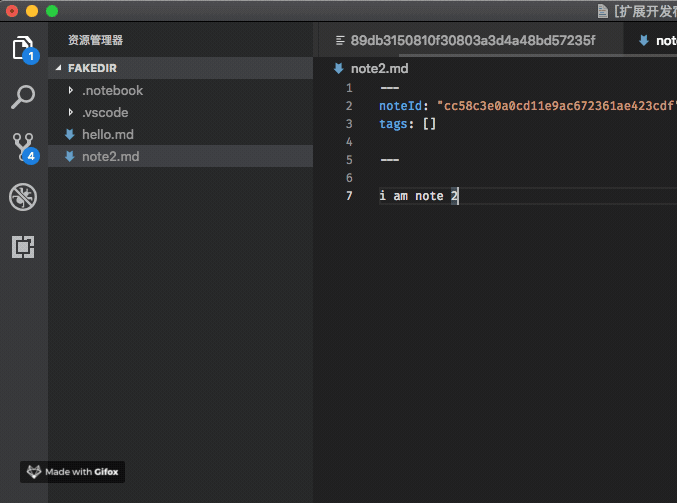
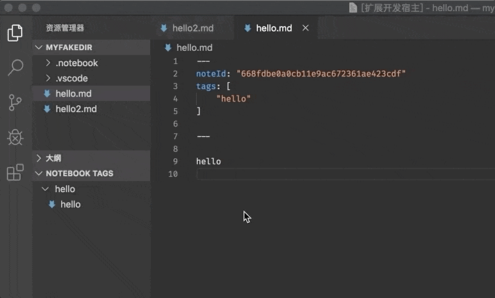
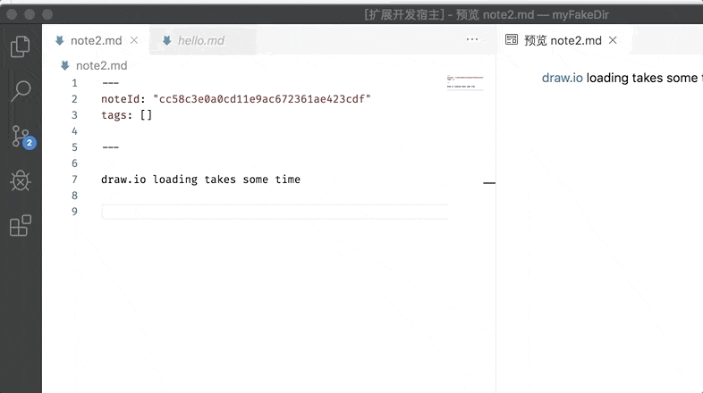
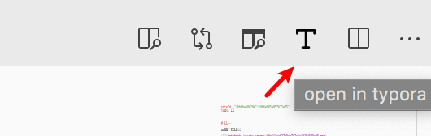

# NoteBook

a markdown notebook plugin


## Feature

### paste text or image



You can custom keyboard shortcut for this command ,eg:
``` JSON
[
    {
        "key": "cmd+v",
        "command": "-editor.action.clipboardCopyAction",
        "when": "editorTextFocus && editorLangId == markdown",
    },
    {
        "key": "cmd+v",
        "command": "notebook.paste",
        "when": "editorTextFocus && editorLangId == markdown",
    }
]
```

#### link paste enhanced

auto get title of link




### Markdown Preview Enhanced Integration

automatically configure [Markdown Preview Enhanced](https://marketplace.visualstudio.com/items?itemName=shd101wyy.markdown-preview-enhanced) by setting `notebook.markdownPreviewEnhancedIntegration` (default:false)




### Notebook Link



### Tag tree view




### draw.io Integration



configuration

- `notebook.drawHost`
  - 'webview' as shown above，open a webview，embedded drawio website
  - 'chrome' open chrome browser, embedded drawio website
  - 'vscode-drawio' **recommend**，open `*.drawio.svg` directly，You can edit this file with the help of vscode extension `eighthundreds.vscode-drawio` or `hediet.vscode-drawio`
- `notebook.drawIoSite` (default:http://draw.io)
  - not work when `notebook.drawHost` is `vscode-drawio`
- `notebook.drawIoLang` (English is default) 
  - not work when `notebook.drawHost` is `vscode-drawio`


### ~~ Typora Integration~~ 
(only work for mac os)  

No more maintenance  




## TODO 

- [x] notebook link
- [x] support window
- [x] save and commit command  
- [x] tag
- [x] drawio
- [ ] mindmap 
